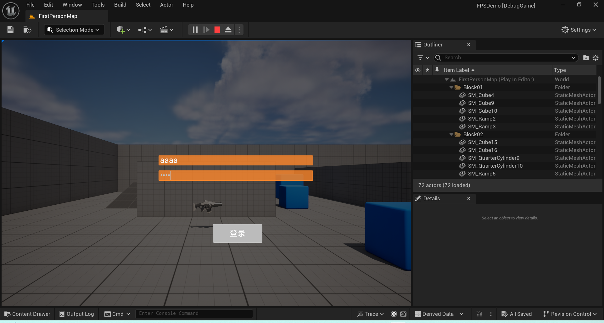
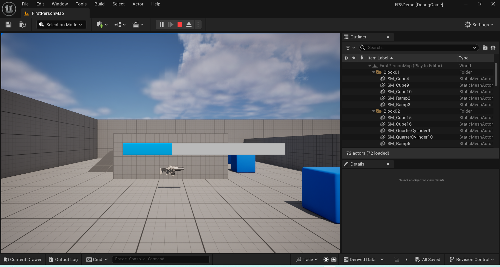
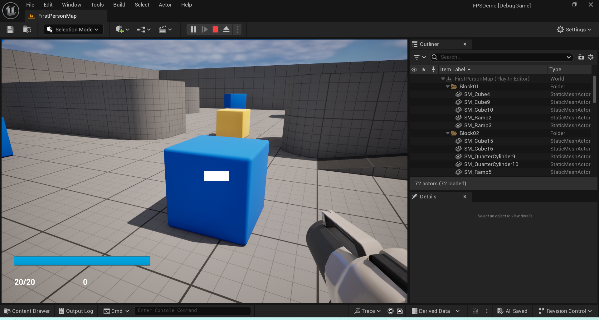
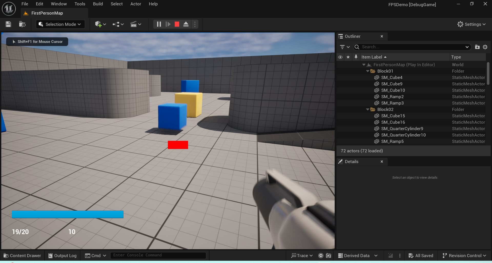
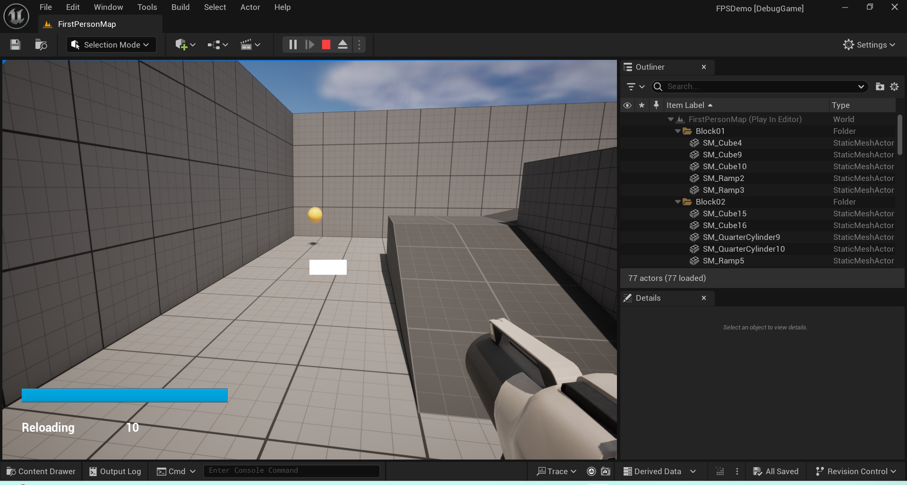

# 作业4

## 作业要求

1.实现登录界面（需要输入用户名和密码，其中密码加密显示，有确认按钮） 

2.实现加载界面（要有动画表传达正在加载） 

3.实现射击游戏操作面板（要有血条，子弹数，击中玩家会发生变化的准星）

## 作业效果

* 登录界面

  

* 加载界面

  

* HUD界面

  

  击中准星效果变换，以及子弹数变换

  

  打完子弹会自动进行装填

  

## 主要代码

主要实现了三个不同的UI Widget类，分别是Login Widget, Loading Widget, HUD Widget

为了方便UI界面管理，还实现了一个简单的UI Manager

下面分别描述UI Manager以及页面的实现思路

### UI Manager

继承自UGameInstanceSubsystem，方便进行单例获取

```c++
UCLASS()
class FPSDEMO_API UUIManager : public UGameInstanceSubsystem
{
    GENERATED_BODY()

public:
    virtual void Initialize(FSubsystemCollectionBase& Collection) override;
    virtual void Deinitialize() override;

    // 管理UI的函数
    
    void ShowWidget(EUIType UIType);
    void HideWidget(EUIType UIType);
    UUserWidget* GetWidget(EUIType UIType);
    UUserWidget* CreateUIWidget(EUIType UIType);

private:
    // 存储所有UI的映射
    TMap<EUIType, UUserWidget*> m_UIInstances;
    TMap<EUIType, TSubclassOf<UUserWidget>> m_UIPaths;
};
```

使用枚举类，通过Map进行对蓝图路径进行管理，在Initialize函数内进行初始化。当需要对页面进行显示的时候，优先检查UI是否存在，如果存在，则直接AddToViewport。如果不存在，则进行初始化后放入管理Map。

### UI页面

三个UI界面实现都比较简单，主要是包含对应的控件指针，以及更新逻辑。

```c++
//登录页面
class FPSDEMO_API ULoginWidget : public UUserWidget
{
	GENERATED_BODY()
	
public:

    virtual void NativeConstruct() override;

	UFUNCTION(BlueprintCallable, Category = "Login")
	void OnConfirmButtonClicked();

private:
    UPROPERTY(meta = (BindWidget))
    class UEditableTextBox* m_UsernameTextBox;

    UPROPERTY(meta = (BindWidget))
    class UEditableTextBox* m_PasswordTextBox;

    UPROPERTY(meta = (BindWidget))
    class UButton* m_ConfirmButton;
};

//加载页面
UCLASS()
class FPSDEMO_API ULoadingWidget : public UUserWidget
{
	GENERATED_BODY()
	
	
public:
	UFUNCTION(BlueprintCallable, Category = "Loading")
	void UpdateProgress(float Progress);
	
private:


	UPROPERTY(meta = (BindWidget))
	class UProgressBar* m_LoadingProgressBar;
};

```

具体的实现方法则是通过各个控件来进行更新，较为简单，不做描述